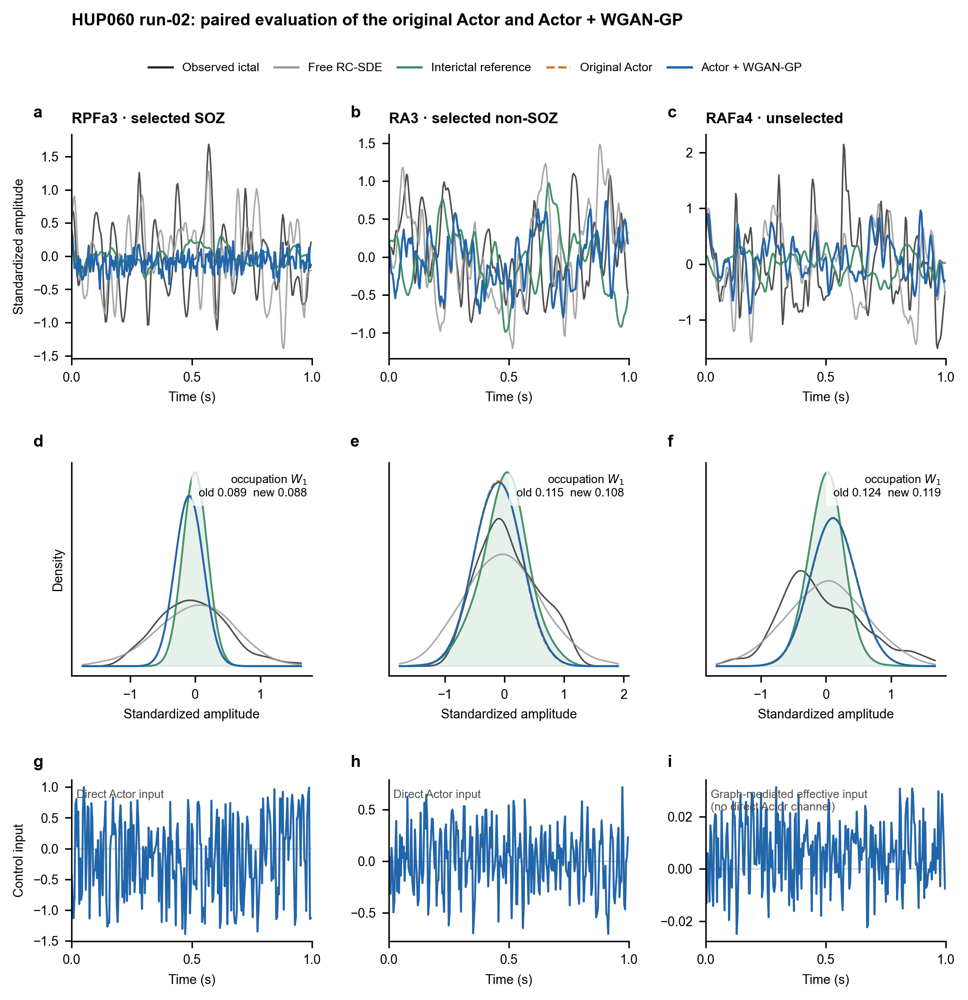

# Taming Epilepsy: Mean Field Control of Whole-Brain Dynamics

## Current manuscript version: Full WGAN-GP, 2026-10-06

The current source and result package is
[`releases/full_wgangp_20261006/`](releases/full_wgangp_20261006/), identified by
[`CURRENT_RELEASE.json`](CURRENT_RELEASE.json) and tag `full-wgangp-20261006`.
It corresponds to the adopted 63-page manuscript, not the historical
teacher-initialized results below. The frozen Graph-RC predictive dynamics and
structured mean-deviation architecture are retained. Empirical-law penalties
and WGAN-GP are combined from the first actor update.

| Case | Direct inputs | Current adopted controller | Time / occupation W1 reduction vs paired free |
|---|---:|---|---:|
| HUP060 | 13/36 | Neutral 1,000-update joint training, selected update 700 | 65.1% / 74.9% |
| HUP065 | 32/64 | Weighted top-32 low-gain expansion of the fresh 23-input controller; selected added update 0 | 26.1% / 29.3% |
| HUP080 | 76/96 | Fresh update 200 followed by parameter adaptation; selected added update 125 | 71.4% / 77.3% |

Both patient extensions are post hoc amended reanalyses. HUP080's declared
single-actuator RMS limit is 0.45; failures at its former 0.405 limit are
retained. The separately archived HUP065 top-32 cold-start experiment is
**not adopted**: its best development checkpoint did not improve the current
32-input result, and its context-6 and outer evaluation were not opened.

The public package supplies exact scientific/plotting source snapshots,
parameters, unrounded summary and channel metrics, current figure files,
provenance hashes, and a signal-free verification command:

```powershell
python -B releases/full_wgangp_20261006/verify_public_results.py
```

This command checks the public files and reported metrics; it does not train
or evaluate on patient arrays. The complete frozen input/model/checkpoint
bundles, all training logs and offline evidence are retained separately in
the author's versioned revision archive. They are required for the documented
private-bundle replay route and are not implied to be public. Original EDF
recordings must be obtained independently from OpenNeuro. See the current
package's `PRIVATE_BUNDLE_REPLAY.md` and `DATA_DICTIONARY.md` for exact scope.

### Historical pipeline documentation

The original root entry points, `PAPER_FINAL_VERSION.json`, eight-figure map,
and `patient-extensions-v1` package below remain historical and unchanged.
They do not select or regenerate the current Full WGAN-GP controllers. Use
the current release package above for this manuscript version.

Reproducible Python implementation and frozen figure bundle for a three-part
brain-network control workflow:

1. connected PLV functional-network construction and actuator selection;
2. state-dependent-diffusion Graph-RC-SDE prediction;
3. structured Actor + WGAN-GP mean-field distribution control.

Every manuscript part has one public model entry point, and every manuscript
figure has an independent plotting script.



## Code-to-figure map

| Part | Single model entry | Independent figure scripts | Figures |
|---|---|---|---|
| I. PLV network and actuator selection | `part1_network/part1_model.py` | `figure_01_plv_network_selection.py` | Fig. 1 |
| II. State-dependent Graph-RC-SDE | `part2_rc_sde/part2_model.py` | `figure_02_rc_sde_prediction.py`, `figure_03_all36_distributions.py`, `figure_04_distribution_errors.py`, `figure_05_input_ablation.py` | Figs. 2--5 |
| III. Actor-WGAN mean-field control | `part3_mfc/part3_model.py` | `figure_06_actor_wgan_control.py`, `figure_07_mfc_ablation.py`, `figure_08_all36_controlled_distributions.py` | Figs. 6--8 |

`mfc_pipeline/` contains shared numerical components imported by these three
entry points; it is not a second set of model variants.

## Unified Part-II/Part-III baseline

Part II reports the exact `u=0` particle branch used as the uncontrolled arm
in Part III.  The two sections share the frozen Graph-RC SDE, context-3 initial
Markov state, effective diffusion multiplier `0.79451175`, 32 particle-wise
innovation paths, and 1-s horizon.  No second uncontrolled rollout is used.

For HUP060 run-02, the representative prediction-to-recording occupation-law
Wasserstein-1 distances are `0.077`, `0.128`, and `0.109`.  Across all 36
electrodes, the mean and median are `0.110` and `0.096`.  Fig. 5's full
state+delay+graph arm reproduces the Part-III `u=0` array with zero maximum
absolute discrepancy.  These prediction metrics are distinct from the
free-to-interictal-reference distances used to quantify control recovery.

The historical artifact under
`artifacts/part2_hup060_context3_window_contract_v1/` documents a superseded
diffusion-scale-1.0 rollout and is retained only for provenance.  It is not an
input to the current paper figures.  `PAPER_FINAL_VERSION.json` is the
authoritative model-and-figure contract.

## HUP065 and HUP080 extensions

The additive [`patient_extensions/`](patient_extensions/) package provides
portable code, configuration templates, lightweight frozen summaries and
accepted publication figures for HUP065 and HUP080. It does not replace or
modify the HUP060 workflow above. HUP080 is explicitly reported as an
exploratory v2 extension after the valid parent-v1 rolling-screen
`NO_GO_before_part3` outcome.

```powershell
python patient_extensions/verify_public_results.py
```

Patient-derived signal arrays, learned weights, raw archives, training
histories and one-time access receipts are intentionally excluded. See
[`patient_extensions/README.md`](patient_extensions/README.md) for the exact
scope and relocation workflow.

## Quick start

```powershell
python -m venv .venv
.\.venv\Scripts\Activate.ps1
python -m pip install -r requirements-lock.txt
python reproduce_all.py --part all
python verify_outputs.py --part all
```

The verification command reports `"status": "pass"` and eight validated
figures.  Outputs are written under `output/` as editable SVG/PDF, preview PNG,
and 600-dpi TIFF.  TIFF files are regenerated locally but excluded from Git to
keep the public repository reasonably sized.  `paper_figures.json` maps each
figure to its generator and Source Data; `output/reproduction_manifest.json`
records file hashes, dimensions, DPI, and environment versions.

Individual parts can be reproduced with:

```powershell
python reproduce_all.py --part 1
python reproduce_all.py --part 2
python reproduce_all.py --part 3
```

The Part-II command rebuilds Source Data from the frozen unified rollout before
running its four independent figure scripts.  Figure reproduction does not
retrain a model or select a favorable trajectory.

## Model and Source Data entry points

```powershell
python part1_network/part1_model.py
python part2_rc_sde/part2_model.py --help
python part3_mfc/part3_model.py --help
```

## Data

Original EEG archives are not included.  To retrain from OpenNeuro
`ds004100` v1.1.3 (DOI: `10.18112/openneuro.ds004100.v1.1.3`), place the
independently obtained subject ZIP files under `data/ds004100/`, or edit
`data.zip_root` in `config_v2.yaml`.  That directory is ignored by Git.

Original sampling rates are read from BIDS metadata.  The analysis pipeline
then applies causal resampling to 256 Hz; therefore a 1-s analysis window has
256 samples without implying that every original recording was sampled at
256 Hz.  See [DATA_NOTICE.md](DATA_NOTICE.md) for data and clinical-use limits.

## Methodological scope

Part III implements a structured state-feedback Actor, a time-conditioned
WGAN-GP critic, and empirical-particle Fokker--Planck propagation on the frozen
Graph-RC-SDE.  The current implementation does not train a separate HJB value
network or evaluate a Bellman/HJB PDE residual; manuscript claims should remain
consistent with that implementation.

Figs. 6 and 8 use the frozen main-result checkpoint.  Fig. 7 uses separately
retrained, matched-budget full, no-WGAN, no-graph-spread, and no-deviation
checkpoints.  Its matched-ablation full checkpoint is not byte-identical to
the Figs. 6/8 main-result checkpoint.

## License and citation

The software is released under the [MIT License](LICENSE).  Dataset-derived
research artifacts remain subject to the upstream terms described in
[DATA_NOTICE.md](DATA_NOTICE.md).  Citation metadata are provided in
[CITATION.cff](CITATION.cff).
